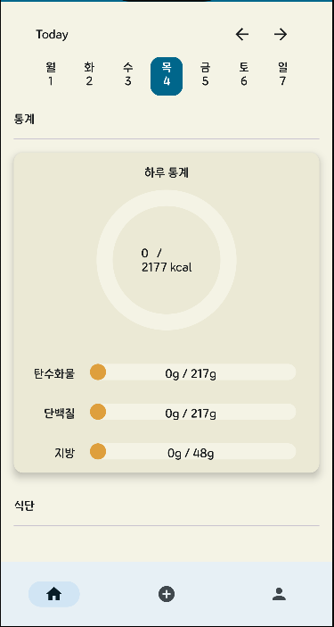
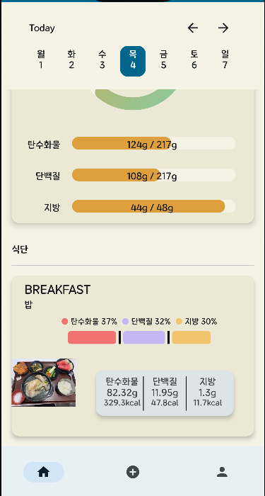
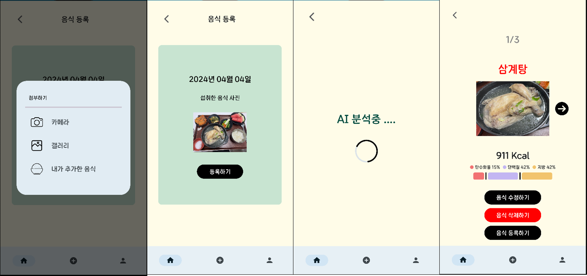
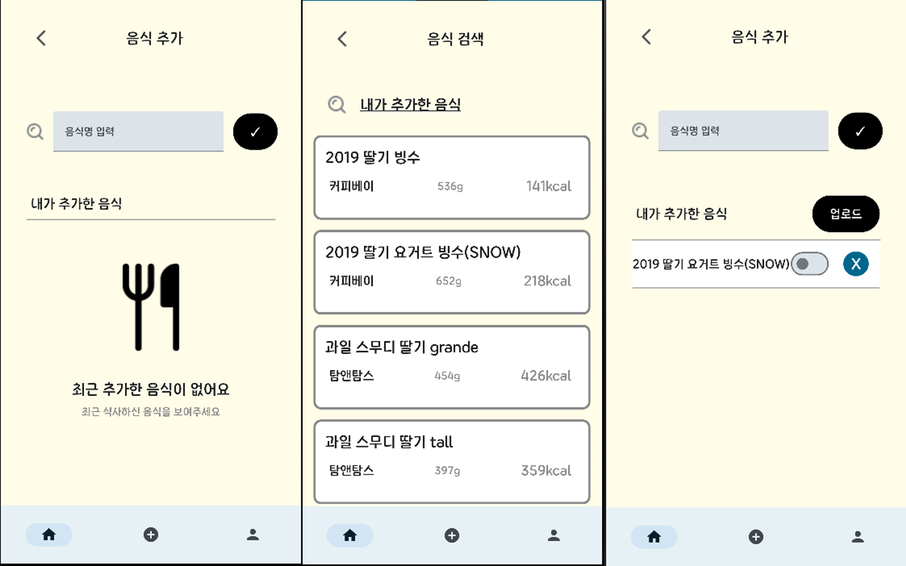
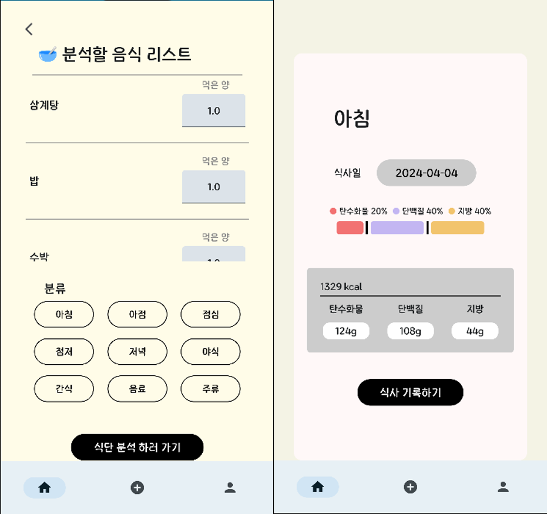
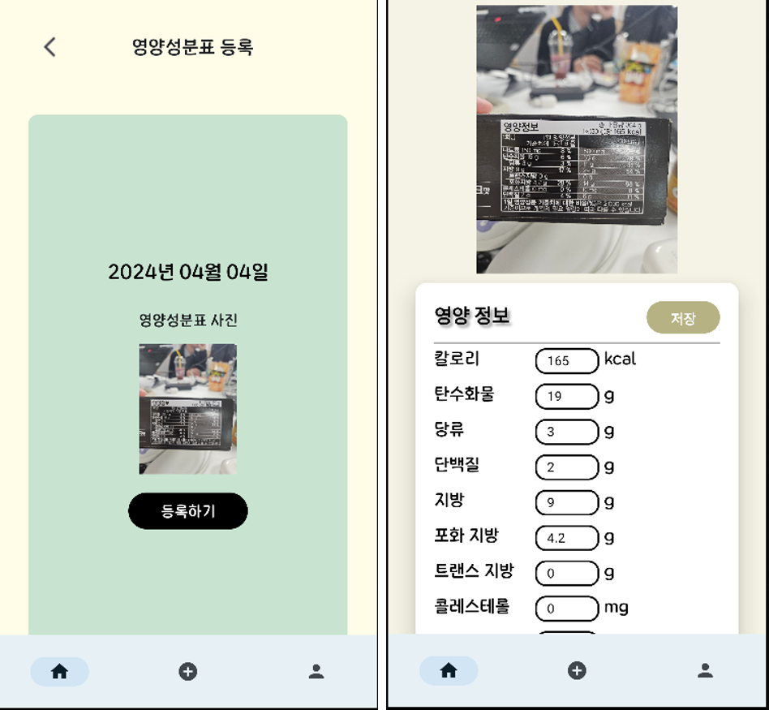
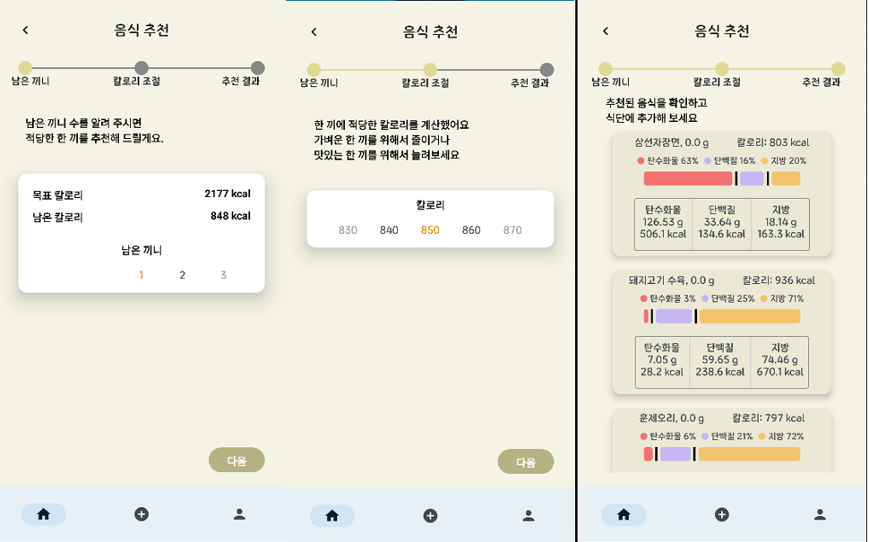
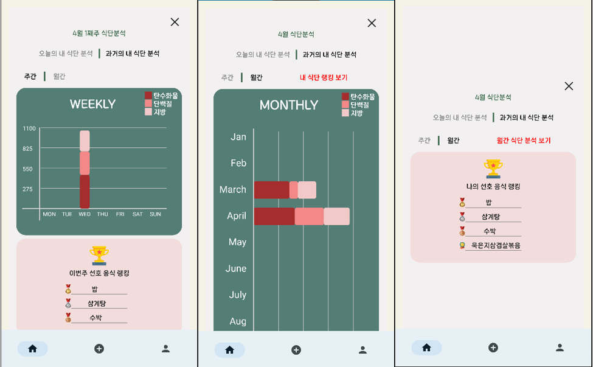
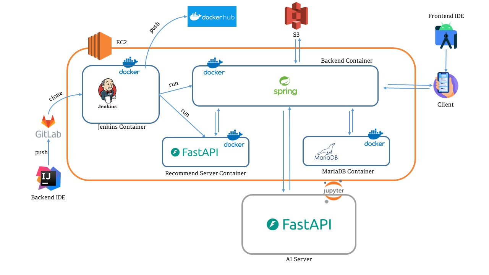
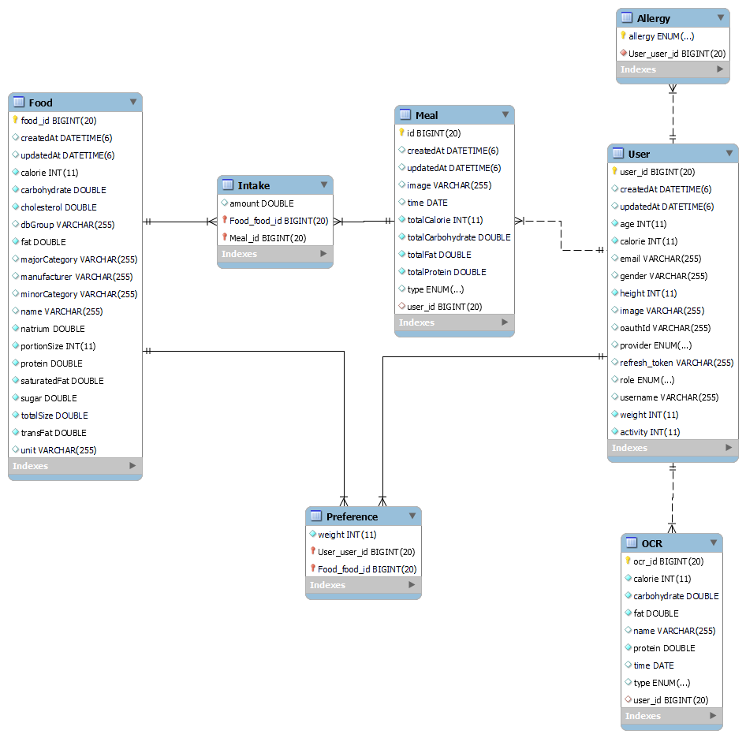

# D(iet) 101
#### [1. 개요](##1. 개요)
#### [2. 과제 목표](#2. 과제 목표)
#### [3. 과제 수행 결과](#3. 과제 수행 결과)
#### [4. 주요 기능](#4. 주요 기능)
#### [5. 기술 스택 정리](#5. 기술 스택 정리)
#### [6. 서비스 아키텍처](#6. 서비스 아키텍처)
#### [7. ERD](#7. ERD)
#### [8. 프로젝트 구조도](#8. 프로젝트 구조도)
#### [9. 팀원 소개](#9. 팀원 소개)

## 1. 개요
"D(iet) 101"은 식단 관리의 편의성을 제공하기 위한 어플리케이션입니다. 사용자들은 자신이 먹을 음식의 사진을 통해, 섭취하는 영양소의 양을 확인할 수 있습니다.

주요 기능으로는 과거 식단 히스토리, 음식 사진 인식, 영양성분표 인식, 섭취 가능 음식 추천 등이 있어 사용자들이 본인의 식단의 영양소 비율을 쉽게 확인할 수 있습니다.

<메인화면 식단 등록 전>

<메인화면 식단 등록 후>

## 2. 과제 목표
### 음식 인식 및 영양 성분 조회
 이미 조리가 된 음식의 경우 해당 음식의 영양 성분을 파악하기가 쉽지 않습니다. 따라서 본 프로젝트에선 대부분의 음식(1인분 기준)의 칼로리와 영양 성분 정보를 데이터베이스로 구축하고 YOLO 모델이 사용자가 촬영한 음식 사진을 인식한 후 해당 음식의 영양 성분을 데이터베이스에서 조회하는 플로우로 서비스를 설계했습니다. 

### 성분표를 반영한 식단 관리의 간소화
식단 관리를 철저하기 위해 일반적으로 먹으려는 식품의 성분표를 참고합니다. 하지만 성분표에는 탄수화물, 단백질, 지방, 나트륨 등등 기재되어 있는 항목들이 많고 이를 사용자가 일일이 식단 관리 어플리케이션이나 개인 노트에 기록하는 것은 생각보다 번거로운 일입니다. 따라서 본 프로젝트에선 OCR 기술을 활용하여 사용자가 촬영한 성분표 사진을 모델이 인식하게 하여 자동으로 기록되도록 서비스를 설계했습니다.

### 필요 영양 성분을 고려한 메뉴 추천
개인의 키, 몸무게 등 본인의 신체에 따라 건강한 식단 관리를 위한 필요 칼로리와 탄수화물, 단백질, 지방의 양이 다릅니다. 또한 이를 반영하여 하루 동안 먹은 음식의 칼로리를 계속 고려해가며 다음 끼니를 고민하는 것 역시  성가신 일입니다. 본 프로젝트는 이를 해결하기 위해 사용자의 식사 누적 칼로리와 탄수화물, 단백질, 지방을 계산하고 여유 칼로리에 해당되는 음식 메뉴들을 collaborative filtering 알고리즘을 통해 추천할 것입니다.

## 3. 과제 수행 결과
### YOLO v8
사용자가 촬영한 음식 사진에서 음식 객체 하나 하나를 구분하고 인식하기 위해 본 프로젝트에선 ultralytics사의 YOLO v8 모델을 활용했습니다. 
다만, YOLO의 경우 학습되어 있는 대부분의 객체 종류들을 모두 인식하지만 해당 서비스에서는 음식만을 인식해야 하기에 이러한 취지에 맞는 fine tunning이 필요했습니다. 또한 인식한 음식을 단순히 '음식'이라고 인지하는 것이 아닌 '삼겹살', '된장찌개' 등등의 구체적인 음식 이름으로 인지해야 하기에 이에 맞는 fine tunning 또한 필요했습니다.
따라서 fine tunning을 위해  kaggle의 'Food-11 image dataset'과 Ai hub의 '건강관리를 위한 음식 이미지'를 데이터셋으로 채택했습니다. 'Food-11 image dataset'의 16,643개의 음식 이미지를 통해 YOLO가 음식만을 인식하도록 했습니다. '건강관리를 위한 음식 이미지'의 경우 3,000,000개의 이미지가 있었지만 해당 이미지들의 클래스가 3,500개 존재했고 너무 많은 레이블은 학습시키기에 하드웨어적으로 부담스러웠기에 클래스를 154개로 줄이고 해당 데이터도 축소하여 총 272,783개의 이미지로 학습을 진행했습니다.

### EasyOCR
성분표를 인식하고 서비스에 자동으로 기록하기 위해 EasyOCR 모델을 활용했습니다. Tesseract, Naver CLOVA 등등 여러 선택지가 많았지만 EasyOCR의 경우 텍스트를 띄워쓰기 기준으로 세그먼트하여 인식하기에 성분표 인식에 알맞는 모델이라 생각되어 선정했습니다.
OCR 모델들은 일반적으로 영어 기준으로 학습이 되어 있기에 한글 학습이 우선되어야 했습니다. 따라서 TextRecognitionDataGenerator을 활용하여 한글 데이터셋을 1,000개 생성하여 문자(한글) 인식 학습을 진행했습니다. 그 후 Ai hub의 '의약품, 화장품 패키징 OCR 데이터'를 활용하여 50,000개의 레이블링 데이터를 학습시켰습니다. kaggle이나 Ai hub 에서도 성분표 데이터셋은 확보할 수가 없었고 그나마 의약품, 화장품에 있는 단어들이 성분표와 유사한 면이 있다 판단하여 선정하게 되었습니다. 마지막으로 '탄수화물', '포화지방' 등등의 성분표에만 있는 단어들을 직접 캡처하고 레이블링한 데이터 800개를 활용하여 fine tunning을 진행했습니다.
Training data와 Validation data는 80:20 비율로 나눴고 Epoch는 3155로 학습을 진행했지만 생각보다 결과가 좋진 않았습니다. 가령 '트랜스 지방'을 '브랜스 지방'으로 인식하고 '단백질'을 '탄백질'로 인식하는 등의 케이스가 확인됐다. EasyOCR을 저런 세부적인 사항까지 인식할 정도로 학습시키기엔 데이터셋이 부족했기에 여러번의 테스팅을 통해 잘못 인식된 케이스들을 분류하고 Regular Expression과 pattern으로 후처리했습니다.

### Collaborative Filtering
잔여 칼로리, 탄, 단, 지를 기준으로 먹을 수 있는 음식을 추천하기 위해 Collaborative filtering 알고리즘을 활용했습니다. sklearn의 cosine_similarity 모듈을 활용하여 데이터 베이스에 존재하는 음식들 간의 코사인 유사도를 산출하여 점수화했습니다. 추가적으로 예측 선호도 공식을 사용해서 산출된 선호도와 코사인 유사도를 테이블에다 놓고 소팅하여 사용자가 좋아할 만한 음식을 추천하게 했습니다.

## 4. 주요 기능

1. **음식 사진 인식**

사용자는 섭취할 음식의 사진을 통해, 해당 음식의 영양소를 확인할 수 있습니다.

- 사진에서 음식만을 인식해, 어떤 음식인지 판단합니다.
- 결과에 오류가 있다면 사용자는 직접 수정이 가능합니다.

- 수정은 검색을 통해 음식을 찾아 업로드를 하면 식단에 추가됩니다.

- 입력이 완료된 식단은 등록할 수 있습니다.
- 전체 섭취한 영양소를 계산해 사용자에게 보여줍니다.

2. **영양성분표 인식**  
 

- 가공 식품 뒷면 영양정보 사진 분석
- 영양 정보 텍스트 추출
- 영양소 이름과 수치 표시
- 저장 버튼 터치 시, 추출한 영양소 이름과 대응하는 OCR 테이블 열에 수치 입력

3. **섭취 가능 음식 추천**

사용자는 활동량, 성별, BMI 지수, 남은 끼니 수 및 남은 칼로리를 통해 식단을 추천받을 수 있습니다.

- 남은 끼니 수를 등록합니다.
- 한 끼에 원하는 칼로리를 등록합니다.
- 등록한 입력 값을 통해 식단을 추천받습니다.

4. **주별, 월별 식단 기록 확인**

사용자는 주별, 월별 섭취한 총 칼로리 및 총 영양소 정보를 확인할 수 있습니다.

- 주별 : 일주일 간 요일 별로 섭취한 탄수화물, 단백질, 지방의 총 비율을 확인할 수 있습니다.
- 월별 : 월 별로 섭취한 탄수화물, 단백질, 지방의 총 비율을 확인할 수 있습니다.
- 주간, 월간 별로 사용자가 섭취한 음식의 빈도를 통해 랭킹을 확인할 수 있습니다.

## 5. 기술 스택 정리

### Frontend
  - **Kotlin** : 안드로이드 앱 개발에 주로 사용되는 정적 타입 지정 프로그래밍 언어입니다. Java와의 상호 운용성, 현대적이고 간결한 문법, 안전성을 목표로 하며, 안드로이드 공식 언어로 지원됩니다.
  - **Jetpack Compose** : Kotlin으로 작성된 안드로이드의 모던 UI 툴킷입니다. 선언적 방식을 통해 UI를 더 간결하고 직관적으로 설계할 수 있게 해주며, 더욱 동적이고 반응적인 앱을 만들 수 있도록 돕습니다.

### Backend 
 - **SpringBoot** : 강력한 RESTful API 개발을 위한 Java 기반 프레임워크입니다.

### Database
- **MariaDB** : 안정적이고 확장성 있는 데이터 관리를 위해 사용되는 오픈소스 관계형 데이터베이스 관리 시스템입니다.

### Infra
- **Jenkins** : 지속적인 통합 및 배포를 자동화하기 위한 오픈소스 자동화 서버입니다. 코드 변경 사항이 발생할 때마다 자동으로 빌드 및 테스트를 수행하고, 성공적으로 완료되면 프로덕션 서버로 배포됩니다.
- **Docker** : 애플리케이션을 컨테이너 내에 패키징하여 의존성 문제 없이 어디서든지 실행할 수 있도록 해주는 오픈 소스 소프트웨어 플랫폼입니다. 이를 통해 애플리케이션의 배포와 관리가 간소화됩니다.

### AI
- **FastAPI** : 현대적이고 빠른 웹 API를 구축하기 위한 Python 프레임워크입니다. 비동기 프로그래밍을 지원하며, 타입 힌트를 기반으로 한 데이터 유효성 검사와 자동 문서화 기능을 제공합니다. 

## 6. 서비스 아키텍처

## 7. ERD

## 8. 프로젝트 구조도
### 📱 Android
:file_folder: d101 
├── :file_folder: api 
├── :file_folder: di 
├── :file_folder: model 
├── :file_folder: navigation 
├── :file_folder: repository 
├── :file_folder: ui 
│   ├── :file_folder: theme 
│   └── :file_folder: view 
│       ├── :file_folder: components 
│       └── :file_folder: screens 
├── :file_folder: utils 
└── :file_folder: viewmodel   
### :file_cabinet: Backend 
:file_folder: com.d101.back 
├── :file_folder: api 
├── :file_folder: config 
├── :file_folder: controller 
├── :file_folder: dto 
│   ├── :file_folder: oauth 
│   ├── :file_folder: request 
│   └── :file_folder: response 
├── :file_folder: entity 
│   ├── :file_folder: composite 
│   └── :file_folder: enums 
├── :file_folder: exception 
│   ├── :file_folder: handler 
│   └── :file_folder: response 
├── :file_folder: filter 
├── :file_folder: repository 
├── :file_folder: service 
└── :file_folder: util   
 
## 9. 팀원 소개
- 팀장 : 김보근
- 팀원 : 김동영
- 팀원 : 박사랑
- 팀원 : 이주미
- 팀원 : 장민성
- 팀원 : 조현우
